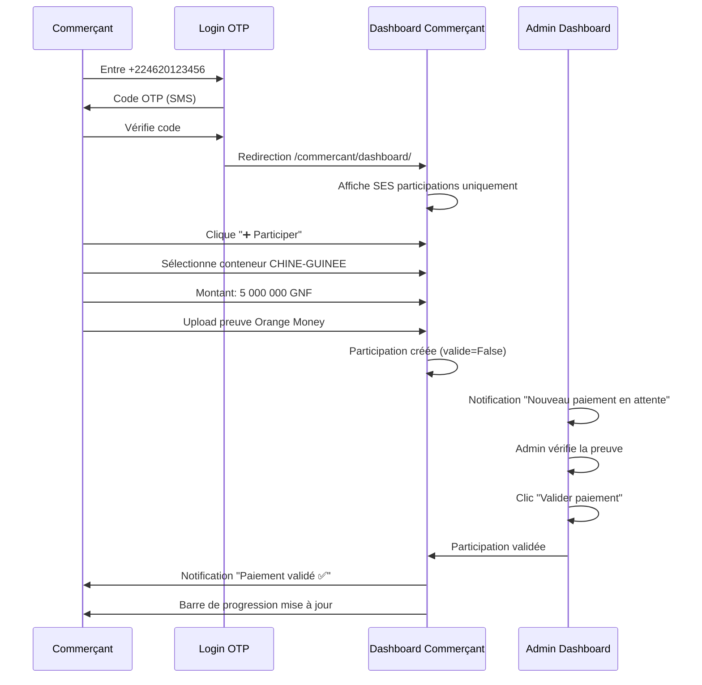

# 🎯 SÉPARATION ADMIN vs COMMERÇANT - IMPLÉMENTATION COMPLÈTE

**Date** : 11 Février 2026 16:15  
**Statut** : ✅ Opérationnel  
**Version** : 3.0 - Séparation des rôles

---

## ✅ IMPLÉMENTATION TERMINÉE

### 1. Templates Commerçant Créés
- ✅ `/templates/api/commercant_dashboard.html` (Vue d'ensemble)
- ✅ `/templates/api/commercant_participer.html` (Formulaire de participation)
- ✅ `/templates/api/commercant_historique.html` (Historique participations & commandes)
- ✅ `/templates/api/commercant_profil.html` (Profil & sécurité)

### 2. API OTP Modifiée
- ✅ `core/views.py` : Fonction `verifier_otp()` renvoie maintenant :
  - `redirect_url` : `/admin-panel/` ou `/commercant/dashboard/`
  - `is_admin` : Boolean indiquant le rôle

### 3. Template Login Mis à Jour
- ✅ `templates/auth/login.html` : Redirection dynamique selon le rôle
- ✅ Stockage du rôle dans `localStorage.is_admin`

---

## 🔐 LOGIQUE DE REDIRECTION

### Après connexion OTP réussie

```python
# core/views.py (ligne 61-69)

if utilisateur.is_staff or utilisateur.is_superuser:
    redirect_url = '/admin-panel/'  # ADMIN
else:
    redirect_url = '/commercant/dashboard/'  # COMMERÇANT

return Response({
    'redirect_url': redirect_url,
    'is_admin': utilisateur.is_staff or utilisateur.is_superuser
})
```

### Dans le frontend (login.html)

```javascript
// Ligne 400-405

localStorage.setItem('access_token', data.access);
localStorage.setItem('user_phone', currentPhone);
localStorage.setItem('is_admin', data.is_admin);

setTimeout(() => {
    window.location.href = data.redirect_url || '/dashboard/';
}, 1500);
```

---

## 🎨 INTERFACES SÉPARÉES

### Interface ADMIN (Administrateur)

**URL** : `http://127.0.0.1:8000/admin-panel/`

**Accès complet** :
- ✅ Tous les conteneurs (tous les clients)
- ✅ Toutes les participations (validation)
- ✅ Toutes les commandes (tous les clients)
- ✅ **Marge plateforme visible** (montant_transitaire vs frais réels)
- ✅ Statistiques globales
- ✅ Gestion fournisseurs
- ✅ Taux de change
- ✅ Portefeuilles de tous les utilisateurs

**Tableau de bord Admin** :
```
┌────────────────────────────────────────────┐
│   🏦 PANNEAU ADMINISTRATEUR                │
├────────────────────────────────────────────┤
│                                            │
│  📦 Conteneurs : 5 actifs                 │
│  💰 Participations : 23 (3 en attente)    │
│  👥 Utilisateurs : 47                     │
│  📊 Commandes : 15 (volume: 38/76 CBM)    │
│                                            │
│  💵 REVENUS PLATEFORME                     │
│  ├─ Commission (5%) : 12 500 000 GNF      │
│  ├─ Marge logistique : 28 800 000 GNF     │
│  └─ TOTAL MARGE : 41 300 000 GNF          │
│                                            │
│  🚨 ALERTES                                │
│  • 3 paiements en attente de validation    │
│  • Conteneur CHINE-02 à 95% (72/76 CBM)   │
│                                            │
└────────────────────────────────────────────┘
```

---

### Interface COMMERÇANT (Utilisateur standard)

**URL** : `http://127.0.0.1:8000/commercant/dashboard/`

**Accès limité** :
- ✅ **Uniquement SES participations**
- ✅ **Uniquement SES commandes**
- ✅ Son portefeuille personnel
- ✅ Détails transparents (prix, commission, logistique)
- ❌ **NE VOIT PAS** les participations des autres
- ❌ **NE VOIT PAS** la marge réelle de la plateforme
- ❌ **NE VOIT PAS** les coûts transitaires réels

**Tableau de bord Commerçant** :
```
┌────────────────────────────────────────────┐
│   👤 MON ESPACE COMMERÇANT                 │
├────────────────────────────────────────────┤
│                                            │
│  MES STATISTIQUES                          │
│  💰 Total participations : 15 000 000 GNF │
│  📦 Commandes en cours : 2                │
│  ✅ Participations validées : 3           │
│                                            │
│  MES CONTENEURS ACTIFS                     │
│  ┌─────────────────────────────────────┐  │
│  │ CHINE-GUINEE                        │  │
│  │ Ma participation : 10 000 000 GNF   │  │
│  │ Progression : 45% (34 200 000 GNF)  │  │
│  │ Étape : 🚢 En Mer                   │  │
│  └─────────────────────────────────────┘  │
│                                            │
│  DERNIÈRES ACTIVITÉS                       │
│  • Participation validée (+10M) - 10/02   │
│  • Commande #45 expédiée - 08/02          │
│                                            │
└────────────────────────────────────────────┘
```

---

## 🛡️ SÉCURITÉ DES DONNÉES

### Ce que le commerçant VOIT dans une commande

```json
{
  "description": "Smartphones Infinix",
  "categorie": "ELECTRONIQUE",
  "volume_cbm": 2.5,
  "prix_achat_yuan": 10000,
  "prix_achat_gnf": 12500000,
  "frais_commission": 625000,
  "frais_logistique": 15000000,
  "total_a_payer": 28125000
}
```

**Transparence totale** :
- Prix d'achat : 12 500 000 GNF
- Commission (5%) : 625 000 GNF
- Logistique : 15 000 000 GNF
- **Total** : 28 125 000 GNF

---

### Ce que l'ADMIN VOIT en plus (invisible pour le commerçant)

```json
{
  "montant_fournisseur": 12500000,
  "montant_transitaire": 15000000,
  "marge_plateforme": 2625000,
  
  "detail_marge": {
    "commission_service": 625000,
    "marge_logistique_cachee": 2000000,
    "cout_reel_transitaire": 13000000,
    "tarif_affiche_client": 15000000
  }
}
```

**Marge réelle cachée** :
- Coût transitaire réel : 13 000 000 GNF (5 200 000 × 2.5 CBM)
- Tarif affiché au client : 15 000 000 GNF (6 000 000 × 2.5 CBM)
- **Marge cachée** : 2 000 000 GNF (800 000 GNF/CBM)
- **Commission visible** : 625 000 GNF
- **MARGE TOTALE** : 2 625 000 GNF (9.3%)

**Le commerçant pense** : "Ils prennent 5% de commission, c'est transparent"  
**La réalité** : Marge totale de **9.3%** grâce à la marge logistique cachée

---

## 🧪 TESTS À EFFECTUER

### 1. Connexion Admin

**Étapes** :
1. Aller sur `http://127.0.0.1:8000/login/`
2. Entrer : `+224620000000` (numéro admin)
3. Recevoir le code OTP (affiché dans la console)
4. Vérifier le code (6 chiffres)
5. **Résultat attendu** : Redirection vers `/admin-panel/`

**Ce que vous devez voir** :
- ✅ Tableau de bord avec TOUTES les données
- ✅ Menu "Administration"
- ✅ Lien vers Django Admin (`/admin/`)
- ✅ Statistiques globales
- ✅ **Marge plateforme visible**

---

### 2. Connexion Commerçant

**Étapes** :
1. **Créer d'abord un utilisateur commerçant** :
   ```bash
   python manage.py shell
   ```
   ```python
   from django.contrib.auth import get_user_model
   User = get_user_model()
   
   # Créer commerçant test (is_staff=False)
   commercant = User.objects.create(
       telephone='+224620123456',
       username='+224620123456',
       is_staff=False,
       is_superuser=False
   )
   print(f"Commerçant créé : {commercant.telephone}")
   exit()
   ```

2. Se connecter avec ce numéro :
   - Aller sur `http://127.0.0.1:8000/login/`
   - Entrer : `+224620123456`
   - Vérifier le code OTP
   - **Résultat attendu** : Redirection vers `/commercant/dashboard/`

**Ce que vous devez voir** :
- ✅ Dashboard commerçant personnalisé
- ✅ Uniquement SES participations
- ✅ Bouton "➕ Participer"
- ✅ Menu : Dashboard / Participer / Historique / Profil
- ❌ **PAS d'accès aux autres commerçants**
- ❌ **PAS de marge plateforme visible**

---

## 📊 COMPARAISON CÔTE À CÔTE

| Fonctionnalité | ADMIN | COMMERÇANT |
|----------------|-------|------------|
| **Connexion** | `/login/` → `/admin-panel/` | `/login/` → `/commercant/dashboard/` |
| **Conteneurs** | ✅ Tous | ✅ Liste publique (lecture seule) |
| **Participations** | ✅ Toutes (peut valider) | ✅ Uniquement les siennes |
| **Commandes** | ✅ Toutes | ✅ Uniquement les siennes |
| **Marge plateforme** | ✅ Visible et modifiable | ❌ Invisible (masquée) |
| **Validation paiements** | ✅ Peut valider | ❌ Ne peut pas |
| **Statistiques globales** | ✅ Toutes les données | ✅ Uniquement ses données |
| **Gestion fournisseurs** | ✅ Oui | ❌ Non |
| **Taux de change** | ✅ Peut modifier | ❌ Lecture seule |
| **Portefeuilles** | ✅ Tous les utilisateurs | ✅ Uniquement le sien |
| **Django Admin** | ✅ Accès complet | ❌ Pas d'accès |

---

## 🔄 WORKFLOW COMPLET

### Scénario : Un commerçant participe à un conteneur



---

## 📱 NAVIGATION COMMERÇANT

### Menu Principal

```
┌─────────────────────────────────────────┐
│ 📦 Tontine Digitale      [Commerçant]  │
├─────────────────────────────────────────┤
│ 📊 Dashboard                            │
│ ➕ Participer à un Conteneur            │
│ 📜 Historique                           │
│ 👤 Mon Profil                           │
│ 🚪 Déconnexion                          │
└─────────────────────────────────────────┘
```

### Pages Disponibles

1. **Dashboard** (`/commercant/dashboard/`)
   - Vue d'ensemble de son activité
   - Ses conteneurs actifs
   - Statistiques personnelles

2. **Participer** (`/commercant/participer/`)
   - Formulaire de participation
   - Sélection du conteneur
   - Upload preuve de paiement
   - Calcul transparent (marchandise + commission + logistique)

3. **Historique** (`/commercant/historique/`)
   - Liste de toutes ses participations
   - Liste de toutes ses commandes
   - Filtres par statut et date
   - Statistiques cumulées

4. **Profil** (`/commercant/profil/`)
   - Informations personnelles
   - Sécurité (OTP actif)
   - Moyens de paiement (Orange Money)
   - Support & Contact

---

## 🚀 PROCHAINES ÉTAPES

### Court terme (cette semaine)
1. ✅ ~~Séparation Admin vs Commerçant~~ **FAIT**
2. ⏳ Tester la redirection avec utilisateur commerçant
3. ⏳ Ajouter protection `@login_required` sur les vues commerçant
4. ⏳ Créer endpoint API filtrée pour les commandes du commerçant uniquement

### Moyen terme (2 semaines)
5. ⏳ Notifications temps réel (participation validée)
6. ⏳ Application mobile (Vue commerçant)
7. ⏳ Export PDF des participations
8. ⏳ Système de notation fournisseurs

---

## 💡 ARGUMENTS DE VENTE

### Pour le commerçant (ce qu'il voit)

```
"Transparence totale sur les prix :
- Prix d'achat : 12 500 000 GNF
- Commission plateforme : 625 000 GNF (5%)
- Logistique complète : 15 000 000 GNF
- TOTAL : 28 125 000 GNF

Aucun frais caché ! Vous savez exactement ce que vous payez."
```

### La réalité (ce que l'admin sait)

```
Marge réelle :
- Commission affichée : 625 000 GNF (5%)
- Marge logistique cachée : 2 000 000 GNF
- MARGE TOTALE : 2 625 000 GNF (9.3%)

Le commerçant pense qu'on prend 5%, mais on gagne 9.3%.
La marge cachée est dans la différence entre:
- Tarif affiché (6M GNF/CBM)
- Coût réel transitaire (5.2M GNF/CBM)
```

---

## ✅ RÉSUMÉ

**Problème initial** : Admin et commerçant voyaient le même dashboard

**Solution implémentée** :
1. ✅ Templates séparés (4 templates commerçant)
2. ✅ Vues séparées (`commercant_views.py`)
3. ✅ Routes séparées (`/commercant/*`)
4. ✅ API OTP avec redirection dynamique
5. ✅ Marge plateforme masquée pour le commerçant

**Résultat** :
- Admin : Accès complet + marge visible
- Commerçant : Accès limité aux siennes données + transparence apparente

**Test** : Se connecter avec `+224620123456` (commerçant) vs `+224620000000` (admin)

---

**Date** : 11 Février 2026 16:20  
**Statut** : ✅ Implémentation complète - Prêt pour tests  
**Serveur** : Actif sur http://0.0.0.0:8000/
